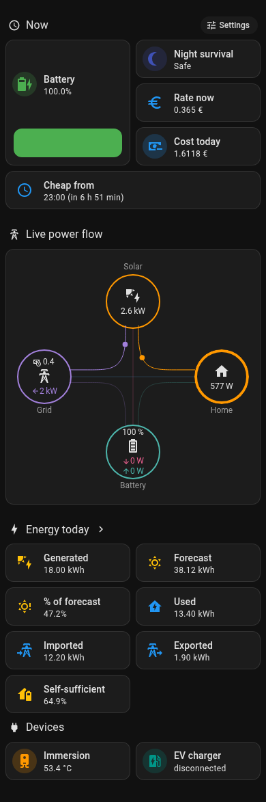
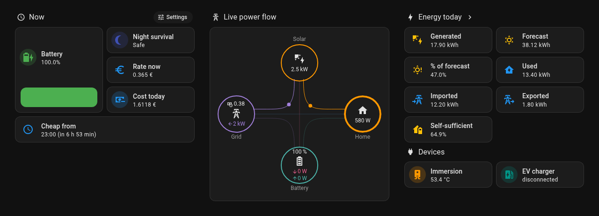
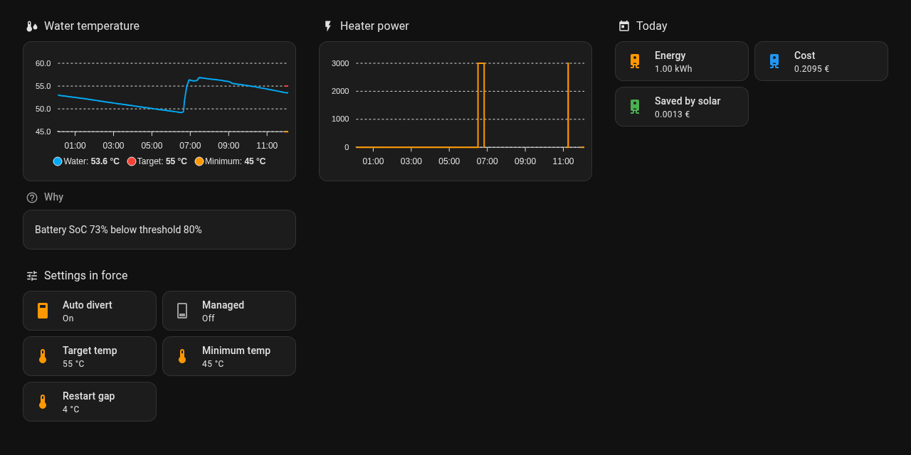
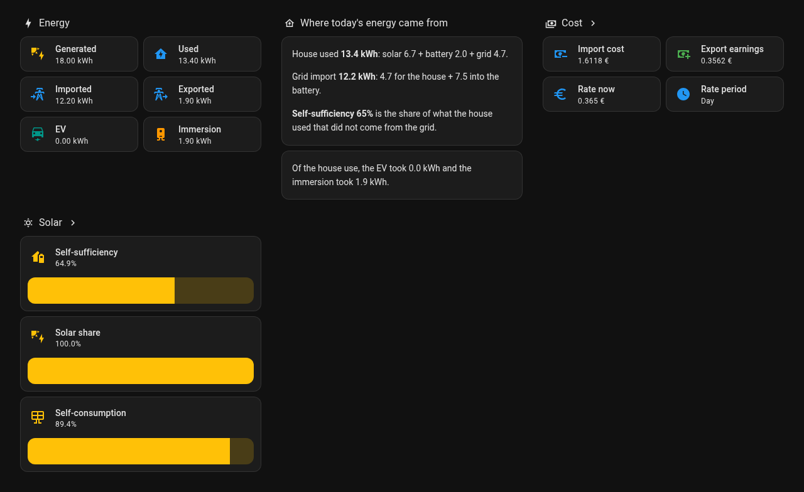
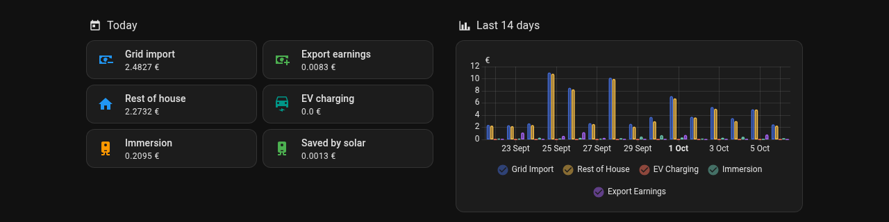
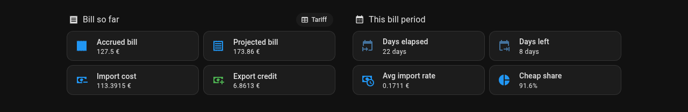
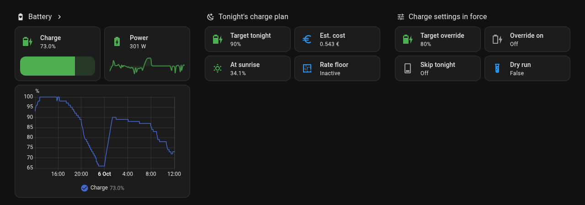
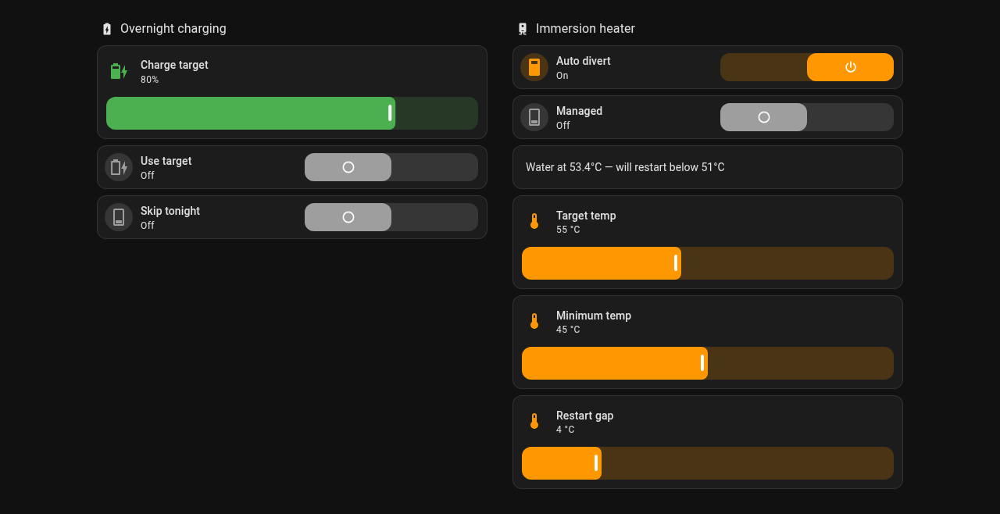

# Dashboard

The integration writes a Lovelace dashboard, filled in with your real entity IDs, to `givenergy_dashboard.yaml` in the Home Assistant config folder.

## Generate the file

Either:

- Press **Refresh Dashboard** on the device page (**Settings → Devices & Services → GivEnergy Inverter Manager**), or
- Run the `givenergy_inverter_manager.get_dashboard_yaml` action in **Developer Tools → Actions**.

A notification, **GivEnergy Dashboard Ready**, confirms the write. The first time the integration is set up it also creates a placeholder file containing `views: []`, so a YAML-mode dashboard can point at the file straight away.

Generate the file again after you change the tariff, rename entities, enable a sensor that is disabled by default, or install a HACS card. The file is overwritten. You do not need to generate it again when you add or remove an EV charger, an immersion switch or an immersion temperature sensor. See [Devices you add or remove later](#devices-you-add-or-remove-later).

The integration writes the file only when you ask. It never rewrites it on its own, because you may have edited it. A dashboard you pasted into the raw editor is stored by Home Assistant, and an integration cannot change a stored dashboard. The [dashboard strategy](#dashboard-strategy-optional) is the only dashboard that is always current, so it is the one to use if you add or remove devices often.

## Example

[`dashboard-example.yaml`](dashboard-example.yaml) is a complete dashboard you can copy and edit. It shows the output for a setup with an immersion heater, an EV charger, an inverter temperature sensor and a solar forecast configured, and with every sensor enabled. The entity IDs are the ones Home Assistant gives a fresh install. If you renamed entities, generate your own file instead.

A test regenerates the example and fails when it no longer matches the generator, so it always shows the current layout.

## What is left out

The file only contains tiles and cards that will show a value.

- A tile is left out when its entity is disabled or not registered. Many sensors are disabled by default. The file header and the **GivEnergy Dashboard Ready** notification list the disabled sensors the dashboard would have used. Enable them in **Settings → Devices & services → Entities**, then generate the file again.
- A section with no tiles left is left out too, so there is never a heading on its own.
- EV tiles and the EV charger sub-view need an EV charger the integration has discovered. They are hidden until it has, and shown when it does. See [Devices you add or remove later](#devices-you-add-or-remove-later).
- The heater tiles, the heater power chart and the divert reason need an immersion switch. The water temperature tile and chart need an immersion temperature sensor. The Target, Minimum and Restart gap tiles and sliders need both, because they act on nothing without a sensor to read.
- Inverter temperature tiles need the inverter temperature entity in the options.
- The forecast tiles need a forecast entity in the options.

## Devices you add or remove later

The EV charger, the immersion switch and the immersion temperature sensor are optional, and you can add or remove any of them at any time. The dashboard follows, with no step from you.

- **A card for a device is hidden until the device exists.** Each card, tile, chart and section that needs a device carries a Lovelace visibility condition on one entity of that device. The condition hides the card while the entity is missing or unavailable. It shows the card as soon as the entity exists, and hides it again when the entity goes.
- **The file already holds those cards.** Without a device, the file points them at the entity IDs Home Assistant will give the device's entities, which follow from the entity names. When the device arrives, the cards show. The file is not generated again and nothing is pasted again.
- **The power flow card and the cost chart are built once for each combination of devices** and the condition shows the one that matches, as a card cannot hide a single row.
- **The Immersion and EV charger sub-views are always in the file.** They have no tab, and nothing opens them while their tiles are hidden.

What each device brings:

| Device | How the integration knows | Shown when it is there |
|---|---|---|
| EV charger | Discovery finds a supported charger. This runs again every five minutes until one is found | Car charger on the flow card, the EV charger tile and sub-view, EV energy and cost tiles |
| Immersion switch | The switch is set under Configure, Immersion heater (or at setup) | Heater power, energy, cost and savings, the divert reason, the Auto divert and Managed settings, the immersion node on the flow card |
| Immersion temperature sensor | The sensor is set under Configure, Immersion heater (or at setup) | The Immersion tile with the water temperature, the water temperature chart |
| Switch and sensor together | Both are set | The Target, Minimum and Restart gap tiles and sliders, and the target and minimum lines on the chart |

With only a switch, the Immersion tile shows the heater power and the sub-view has no temperature chart. With only a sensor, it shows the water temperature and nothing about a heater.

The integration creates the entities of a device only while the device exists. See [Sensors](sensors.md). So the sensor the dashboard hides on is not a dead entity. It is the entity that arrives with the device. The water temperature sensor mirrors the sensor you set, so the dashboard has a stable entity to chart.

What still needs a new file or a reload of the strategy dashboard:

- an entity you renamed after you generated the file, and a sensor you enabled
- the Tariff table, the administrator list and the HACS card choice, which are read when the file is generated
- a charger whose entity IDs differ from the ones Home Assistant assigns by default, for example because an entity with that ID already existed

## Add the dashboard

### UI mode

1. Open `givenergy_dashboard.yaml` in your config folder, for example with the File editor add-on.
2. Copy the whole file.
3. Go to **Settings → Dashboards → Add Dashboard → Blank**.
4. Open the new dashboard, then the three-dot menu, **Edit dashboard**, then the three-dot menu again and **Raw configuration editor**.
5. Replace the content with the copied YAML and save.

After regenerating, repeat steps 1 to 5. A device added or removed does not need this.

### YAML mode

Add this once to `configuration.yaml`, then restart Home Assistant:

```yaml
lovelace:
  dashboards:
    givenergy:
      mode: yaml
      filename: givenergy_dashboard.yaml
      title: GivEnergy Inverter Manager
      icon: mdi:solar-power-variant
      show_in_sidebar: true
```

After regenerating, reload the dashboard or restart Home Assistant. A device added or removed does not need this.

## Dashboard strategy (optional)

Instead of a generated file, a dashboard can build itself each time it opens. Create a dashboard, open the Raw configuration editor and use this as the whole configuration:

```yaml
strategy:
  type: custom:givenergy-manager
```

The integration serves a small JavaScript file at `/givenergy_inverter_manager/givenergy-manager-strategy.js` and adds it to the frontend as a module. The file asks Home Assistant for the dashboard over a websocket command, `givenergy_inverter_manager/dashboard`, which returns the same dashboard as the action, built from the current entity registry, options and Lovelace resources. Changing the tariff, enabling a sensor, installing a HACS card, or adding or removing a device shows up on the next page load, with no file to regenerate. This is the dashboard to use if your devices change. A file or a pasted dashboard hides the cards of a missing device but is otherwise fixed until you generate it again.

- Reload the browser tab after you first set up or upgrade the integration, so the frontend loads the file.
- The strategy needs a loaded config entry. Without one the dashboard shows a short message instead.
- The skipped sensor list and the header notes in the file are not part of the strategy output.
- The generated file and the action work the same with or without the strategy.

## HACS cards

| Card | Needed for | Behaviour without it |
|---|---|---|
| [power-flow-card-plus](https://github.com/flixlix/power-flow-card-plus) | The live flow card in the Power Flow tab | An entities card lists the same values |
| [apexcharts-card](https://github.com/RomRider/apexcharts-card) | The immersion charts in the Immersion sub-view | A history graph of the temperatures and a statistics graph of immersion energy replace them |

When you generate the file, the integration reads the Lovelace resource list (**Settings → Dashboards → Resources**). A card whose URL is not in the list is treated as not installed, and the built-in cards are used. The file header names the cards it replaced. Install the card from HACS and generate the file again to get the custom card.

A card loaded some other way, for example by another integration, does not appear in the resource list. Add it as a resource, or the generator will replace it. If the list cannot be read, the generator assumes both cards are installed.

Everything else uses built-in Home Assistant cards.

## Layout

The screenshots in this section use the dark theme. The values are from a working install and will differ on yours.

Every view is a Home Assistant **sections** view. Each section is a column of cards that starts with a heading, and the sections sit side by side on a wide screen: one column on a phone, two on a tablet, three on a desktop. Tiles are the main building block. They are all horizontal, two to a row on a phone (six of the twelve grid columns), and use colour the same way everywhere: amber for solar, green for the battery and savings, blue for the grid and money, orange for the immersion, teal for the EV charger and indigo for the night.

The controls use tile features: a slider on the number entities and a toggle on the switches. They sit in the Settings sub-view, which only administrators see. Everywhere else a tile shows a setting's value and does nothing when tapped. A bar shows state of charge. Charts take the full width of their section.

The dashboard has four tabs. Detail sits in seven sub-views that have no tab. A tile, heading or button on a tab opens each sub-view, and the back arrow at the top of the sub-view returns to that tab. A heading that opens a view shows a chevron.

| Tab | Sub-views it opens |
|---|---|
| Power Flow | Immersion and EV charger (the Devices tiles), Battery detail (Night survival tile), Settings (the Settings button in the Now heading, administrators only) |
| Today | Cost breakdown (Cost heading), Solar and forecast (Solar heading) |
| Bill | Tariff (the Tariff button in the Bill so far heading) |
| Battery | Battery detail (Battery heading) |

A sub-view and the tile that opens it are left out when the sub-view would be empty. The Immersion and EV charger sub-views are the exception: they stay in the file so a device added later has somewhere to show, and their tiles are hidden until the device exists.

The links use relative paths, so they work at any dashboard URL.

On a phone the sections stack in one column:



### Settings and administrators

Everything that changes a setting is in the **Settings** sub-view. A small **Settings** button in the Now heading of the Power Flow tab opens it. Both are for Home Assistant administrators only. Everyone else sees neither, and the rest of the dashboard only shows state.

Home Assistant has no admin option for a dashboard. A view takes a list of users in `visible`, and a card or heading button takes a user condition. So the generator reads the IDs of the active administrators from Home Assistant and writes them into the Settings view and into the button.

- **No administrator found.** The Settings view and its button are left out for everyone. Home Assistant always has at least one administrator, so this only happens when the user list could not be read.
- **Administrator roles change.** The IDs are read when the dashboard is generated. For a file, press **Refresh Dashboard** or run `get_dashboard_yaml` after you promote or demote a user, then paste the file over the old dashboard again. A dashboard that uses the [strategy](#dashboard-strategy-optional) reads the list each time it opens, so a reload of the page is enough.
- **A copied example.** The user ID in [`dashboard-example.yaml`](dashboard-example.yaml) is a placeholder. Generate your own file.

This hides the controls. It is not security. Home Assistant has no permissions for single entities, so a user who is not an administrator can still change the switches and numbers from the entity page, the Entities list, another dashboard, an automation or the API. The Settings view is also still reachable by its URL (`/settings` under the dashboard), as Home Assistant only hides the tab. Use it to keep a shared wall tablet or a family dashboard tidy, not to protect the inverter.

### Power Flow



- **Now**: Battery (state of charge with a bar), Night survival, Rate now, Cost today, Cheap from (Next Cheap Rate Start) and Cheap in (Hours to Cheap Rate). Night Survival Confidence and the two cheap rate sensors are disabled by default, so a new install shows three of the six until you enable them. Night survival reads Safe, Warning or Critical. Tap it to open Battery detail, which says in words why. Tap the Battery tile to open the Battery tab.
For administrators the heading also holds a **Settings** button.
- **Dry run is on**: a banner with the last skipped action, below Now. It appears only while Dry Run Mode Active is true.
- **Live power flow**: a power-flow-card-plus card with solar, battery, grid, home and, when they exist, two individual loads: the EV charger and the immersion. Solar shows a clipping marker. The battery node reads Battery Power for the flow and Battery State of Charge for the percentage. Battery Power is positive while charging and the card expects the opposite, so the node sets `invert_state: true`. The grid node shows the Live Grid Cost Rate.
- **Energy today**: Generated, Forecast and % of forecast (with a forecast sensor set), Used (House Load Today), Imported, Exported and Self-sufficient. Forecast is the provider's own figure for today and % of forecast is the solar generated so far against it. Self-sufficient is the share of what the house used that did not come from the grid. Tap the heading to open the Today tab, which shows where the energy came from.
- **Devices**: an Immersion tile (the water temperature, or the heater power when there is no sensor) and an EV charger tile (the charger state). Each opens its sub-view. The heading and each tile show only while their device exists.

For the EV load, the dashboard uses the first of these entities that exists, else the integration's own EV Charging Power: `sensor.myenergi_zappi_power_ct_internal_load`, `..._2`, `sensor.myenergi_zappi2_power_ct_internal_load`, `sensor.wallbox_charging_power`, `sensor.ohme_current_power`.

### Immersion (sub-view)



Each section shows only while the device it needs exists.

- **Water temperature** (needs the sensor): a 12-hour chart of water temperature. With a switch as well, it also draws the target and minimum.
- **Why** (needs the switch): the divert reason in words.
- **Heater power** (needs the switch): a 12-hour step chart of the immersion's power in watts.
- **Today** (needs the switch): energy, cost and what solar saved.
- **Settings in force** (needs the switch): Auto divert and Managed, to read. With a sensor as well it adds Target temp, Minimum temp and Restart gap. Change them in Settings.

### EV charger (sub-view)

- **Charging now**: charger state, charge power, session energy and charging source.
- **Why**: whether the EV is draining the battery, the solar surplus available and the mode decision in words.

### Today


- **Energy**: Generated, Used, Imported, Exported, EV and Immersion.
- **Where today's energy came from**: three lines in plain words, then one line for each of the EV and the immersion that exists.
  - House used: what the house used, split into solar, battery and grid. Solar and battery show as one figure until you enable the Battery Discharged Today sensor, which is disabled by default.
  - Grid import: what came in from the grid, split into the part the house used and the part that went into the battery. The split needs the inverter's AC charge counter. Without it the card says the split is not known and counts all of the import as used by the house.
  - Self-sufficiency: the share of what the house used that did not come from the grid.
  - EV and immersion: how much of the house use went to each. They are part of the house use, not added to it. A line shows only while its device exists.

  The card reads four attributes of the Self Sufficiency sensor: `house_load_kwh`, `from_grid_kwh`, `grid_to_battery_kwh` and `basis`. Where one is missing it uses the House Load Today and Grid Import Today totals. The whole group is left out when Self Sufficiency, House Load Today or Grid Import Today is missing.
- **Cost**: Import cost, Export earnings, Rate now and Rate period. The heading opens Cost breakdown.
- **Solar**: Self-sufficiency, Solar share and Self-consumption, each with a bar. The heading opens Solar and forecast.

### Cost breakdown (sub-view)



A tile for every cost line today (grid import, export earnings, rest of house, EV charging, immersion and what solar saved the immersion) and a bar graph of cost per day over 14 days.

### Solar and forecast (sub-view)

With a forecast sensor set: Generated today, Forecast, % of forecast, Plan forecast and Yesterday (the accuracy of yesterday's forecast). Below them is a bar graph of solar generation per hour over 2 days.

Forecast is what your forecast service predicted for today, as it stood just before midnight. % of forecast compares solar generated so far with that figure. Plan forecast is the figure the overnight charge calculation used: blended toward the pessimistic estimate and scaled by the accuracy correction, so it can differ from the provider's figure. Judge the day against Forecast. Forecast and % of forecast read empty on a new install until the first midnight, because the provider forecast is remembered then.

The two graphs on the sub-views are statistics graphs, not history graphs. The daily sensors fall to zero at midnight, so a history graph of them draws a sawtooth. The graphs plot the change in each period instead, from the long-term statistics. They stay empty until Home Assistant has compiled statistics for the sensors, which takes up to an hour.

### Bill



Figures for the current bill period, so you can hold them against your supplier bill.

- **Bill so far**: Accrued bill, Projected bill, Import cost and Export credit. A **Tariff** button in the heading opens the Tariff sub-view.
- **This bill period**: Days elapsed, Days left, Avg import rate and Cheap share (the cheap rate share of import).

Days Elapsed in Bill Period, Average Import Rate This Month and Cheap rate import fraction this month are disabled by default. Enable them to see those tiles.

Accrued Bill This Period is worked out line by line from the month totals: energy less the supplier saving, standing charge, PSO levy and VAT, minus the export credit. Projected Bill This Period scales it to the whole period. See [Tariff](tariff.md#bill-sensors). Import cost this month is the import energy for the period after discount and VAT. It leaves out the standing charge, the PSO levy and the export credit.

### Tariff (sub-view)

A table of the base rate and each timed rate period with its window, the rate, and the rate billed per kWh after the supplier discount and VAT. It also lists the export rate, standing charge, PSO levy and bill start day.

The table is read from your options when the file is generated, so generate the file again after you change the tariff. It uses the same defaults as the integration for any field you have not set.

### Battery



- **Battery**: state of charge with a bar, battery power with a 24-hour trend, and a 24-hour history of state of charge. The heading opens Battery detail.
- **Tonight's charge plan**: Target tonight, Est. cost, At sunrise (estimated state of charge) and Rate floor (the cheap rate floor).
- **Charge settings in force**: the charge target override (Target override and Override on), Skip tonight and Dry run, to read. Change the first three in Settings. Dry run is an option of the integration.

State of charge and power are not drawn on one graph, because a percentage and watts share no scale.

### Battery detail (sub-view)

- **Night survival**: the level in bold, then why. Where the Night Survival Confidence sensor has an `explanation` attribute, that is shown. Otherwise a Warning is explained from the estimated state of charge at sunrise ("about 14% at sunrise, close to your minimum charge"), and Safe and Critical show the Battery Night Survival Status text, which carries any kWh shortfall. Without the confidence sensor, which is disabled by default, only the status text is shown. Under it, the reason for tonight's charge target. Both are sentences, and a tile cuts them off, so they sit in Markdown cards.
- **Battery health**: total cycles, life remaining, days since full charge, and the inverter temperature and status.

### Settings (sub-view, administrators only)



- **Overnight charging**: a slider for the charge target, and the Use target and Skip tonight switches.
- **Immersion heater**: the Auto divert and Managed switches and the divert reason in words. With a temperature sensor as well, sliders for the target temperature, the minimum temperature and the restart gap.

The view is left out when there is no administrator to show it to, and the immersion section is hidden while there is no immersion switch. The dry run banner is not here. It sits on the Power Flow tab, below Now, and appears only while Dry Run Mode Active is true.

There is no Refresh Dashboard card. Use the button on the device page.

## HTML report cards

Three sensors carry a styled HTML report in their `html` attribute: Today's energy summary, Tonight's charge plan and This week's energy summary. They use inline styles, so the built-in Markdown card renders them.

They are disabled by default. Enable them in the entity list first.

```yaml
type: markdown
content: "{{ state_attr('sensor.givenergy_inverter_manager_todays_energy_summary', 'html') }}"
```

Replace the entity ID with the real one from **Settings → Entities**.

The Solar row of Today's energy summary carries the same forecast as the dashboard: the provider's own forecast for today and the share of it generated so far, matching Forecast and % of forecast. The row shows no forecast until the provider's figure has been remembered at the first midnight. Tonight's charge plan shows the plan's forecast on its own row, labelled Plan forecast, because the charge calculation blends it toward the pessimistic estimate. The accuracy rows of This week's energy summary measure against the provider's forecast too.
